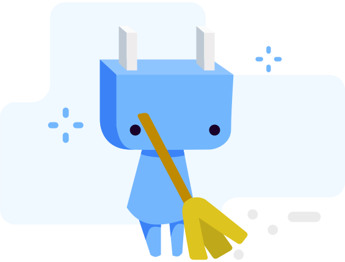

<h1 align="center">🏹 LinkRoom</h1>

# 🏷️ About

LinkRoom is a Link Dashboard Progressive Web App. Something like LinkTree. Currently a work in progress.

Came up with this app idea since I noticed most of my classes have different links that are not only hard to manage but also hard to navigate over time. I'm making this app for students or anyone who wants to have one place for all their links like a bookmark just by going to one site which is LinkRoom.

Made with ViteJS, React, Tailwind, DnDKit, and a couple more cool packages. See the `package.json` file for all dependencies used for this project.

# 🔌 Meet Our Mascot - Socket

The cutest blue socket character carrying the LinkRoom brand. Illustrations were also a little bit inspired by Wumpus, Discord mascot. Concept by [glecy](https://github.com/glecy).

# ✍ To Dos:

- [x] Working Drag and Drop
- [ ] Single Edit Mode (Modal)
- [ ] Install PWA Modal or `/install` landing page.
- [ ] Toast Tip System (Tracked with LocalStorage)
- [ ] Mobile Version: Bottom Nav and Sorting Page
- [ ] FAQs Page
- [ ] Error-checking if data is valid. Catch error and reset all data if not.
- [ ] Release 🚀🚀🚀
